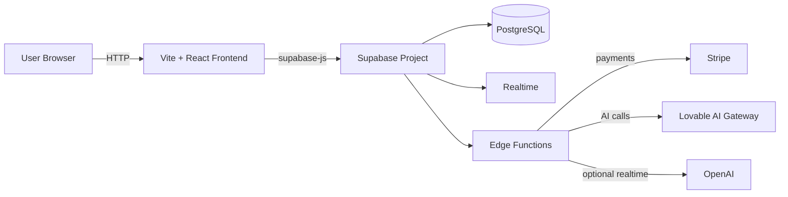

## 🎮 GameGlory Marketplace

## Project overview
GameGlory is a modern gaming marketplace that combines **AI-powered discovery & safety**, **secure payments with escrow**, and **real-time social features** (hubs, streams, watch parties) into one platform.

## Features list

### 💳 Enterprise Payments
- Stripe integration with PCI compliance
- Escrow protection for all transactions
- Automated dispute resolution
- Seller payout management

### 🔔 Real-Time Experience
- WebSocket-powered notifications
- Live chat in hangouts and streams
- Real-time market data
- Instant activity feeds

### 🎮 Social Gaming
- Achievement system with XP progression
- Dynamic leaderboards
- Community hubs and posts
- Watch parties and esports events

### 📊 Advanced Analytics
- Comprehensive platform metrics
- Market intelligence and trends
- Performance monitoring
- Business intelligence reports

## Tech stack
### Frontend
- **Vite + React + TypeScript**
- **shadcn/ui + Radix UI** components
- **Tailwind CSS** styling
- **@tanstack/react-query** data fetching/caching

### Backend
- **Supabase** (PostgreSQL + Auth + Realtime + Edge Functions)
- **Row Level Security (RLS)** policies across tables

### Payments & AI
- **Stripe** (client + server)
- **Lovable AI Gateway** (Gemini models) for recommendations/search/moderation
- **OpenAI** (optional) for realtime session features

## Architecture diagram


## How to run locally
### 1) Install dependencies
```bash
cd gameglory-market-main
npm install
```

### 2) Set environment variables
Create/edit `.env.local` (or `.env`) in the project root:

```env
VITE_SUPABASE_URL=https://YOUR_PROJECT_REF.supabase.co
VITE_SUPABASE_PUBLISHABLE_KEY=your_supabase_anon_key
```

### 3) Run the frontend
```bash
npm run dev
```

Open the URL Vite prints (this repo is configured to use port **8080**), typically:
- `http://localhost:8080`

### 4) (Optional) Run Supabase tasks locally
If you want to run migrations / deploy functions, use `npx` (recommended on macOS to avoid global-install permissions):

```bash
npx supabase login
npx supabase link --project-ref your-project-ref
npx supabase db push
npx supabase functions deploy
```

For a longer step-by-step guide, see:
- `backend/docs/setup-instructions.md`
- `backend/docs/deployment-guide.md`

## 📁 Project Structure

```
gameglory-market-main/
├── src/                    # Frontend React application
│   ├── components/        # Reusable UI components
│   ├── pages/            # Page components
│   ├── contexts/         # React contexts
│   ├── hooks/            # Custom React hooks
│   └── integrations/     # External service integrations
├── backend/              # Backend infrastructure
│   ├── database/         # SQL migrations and schemas
│   ├── functions/        # Supabase Edge Functions
│   ├── config/           # Configuration files
│   └── docs/            # Documentation
├── public/              # Static assets
└── package.json         # Dependencies and scripts
```

## 🔧 Development

### Available Scripts
```bash
npm run dev          # Start development server
npm run build        # Build for production
npm run build:dev    # Build for development
npm run lint         # Lint code
npm run preview      # Preview production build
```

### Supabase Commands
```bash
npx supabase start       # Start local Supabase
npx supabase stop        # Stop local Supabase
npx supabase status      # Check status
npx supabase db push     # Push database changes
npx supabase functions deploy  # Deploy functions
```

## 🚀 Deployment

### Frontend
Deploy to Vercel, Netlify, or any static hosting service:
- Build command: `npm run build`
- Output directory: `dist`
- Set environment variables in hosting platform

### Backend
Supabase handles backend deployment automatically:
- Database: Managed PostgreSQL
- Functions: Auto-scaling Edge Functions
- Real-time: Built-in WebSocket support

## 📚 Documentation

- **Setup Instructions**: `backend/docs/setup-instructions.md`
- **Deployment Guide**: `backend/docs/deployment-guide.md`
- **Architecture**: `backend/docs/architecture-overview.md`
- **Backend README**: `backend/README.md`

## 🔐 Environment Variables

### Required Variables
Create `.env.local` with:

```bash
# Frontend
VITE_SUPABASE_URL=https://your-project.supabase.co
VITE_SUPABASE_PUBLISHABLE_KEY=your-anon-key
VITE_STRIPE_PUBLISHABLE_KEY=pk_test_your-stripe-key

# Backend (set in Supabase dashboard)
SUPABASE_URL=https://your-project.supabase.co
SUPABASE_SERVICE_ROLE_KEY=your-service-key
STRIPE_SECRET_KEY=sk_test_your-stripe-secret
LOVABLE_API_KEY=your-lovable-key
OPENAI_API_KEY=your-openai-key  # Optional
```

See `backend/docs/setup-instructions.md` for detailed setup.

## 🛡️ Security

- **Row Level Security** on all database tables
- **PCI Compliant** payment processing
- **Encrypted** data transmission
- **API Key** protection
- **Fraud Detection** systems

## 🤝 Contributing

1. Follow the established code structure
2. Add comprehensive tests
3. Update documentation
4. Ensure RLS policies for new features
5. Test locally before deploying

## 📄 License

This project is built with modern web technologies and Supabase for the extraordinary gaming marketplace experience.

---

**🎮 Ready to level up your gaming marketplace?**
